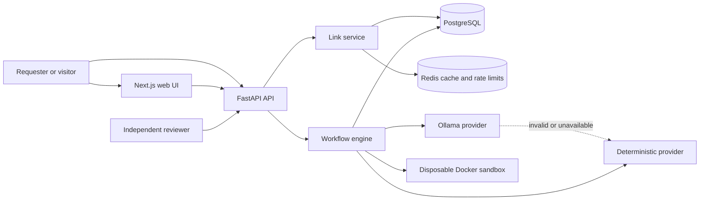
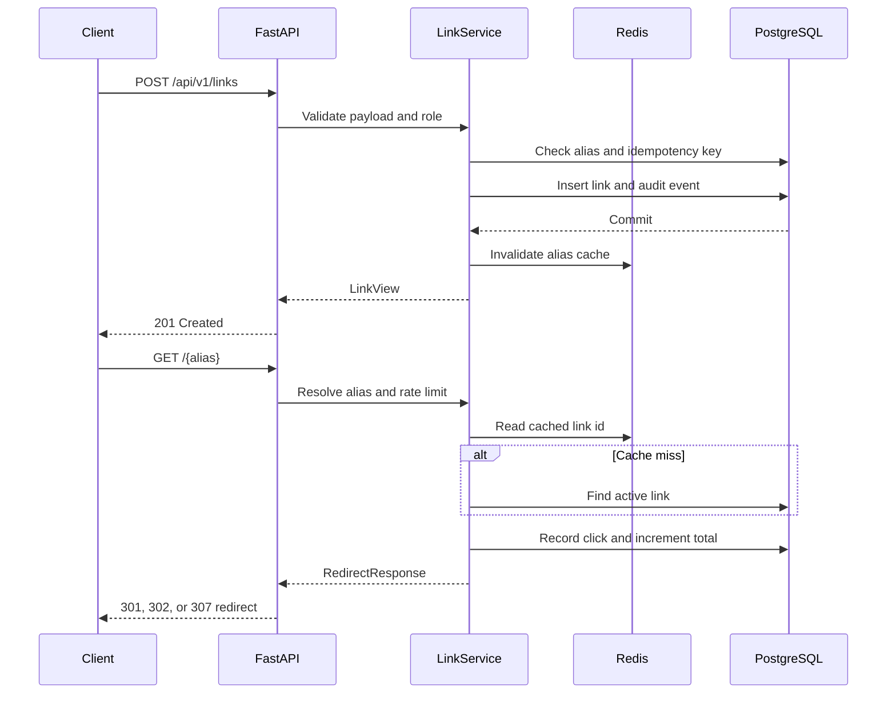
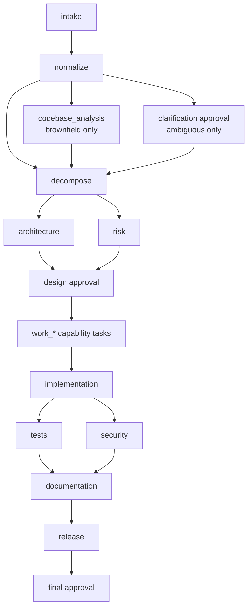
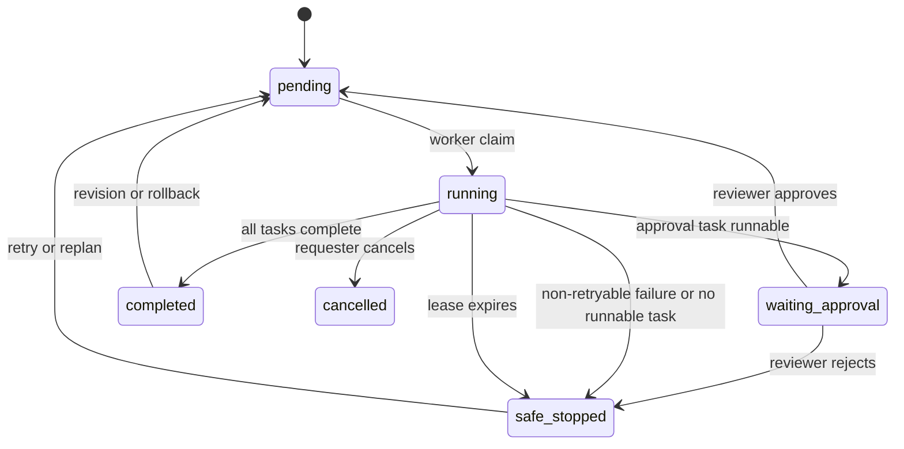
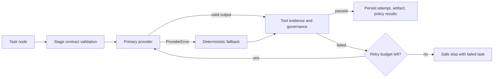
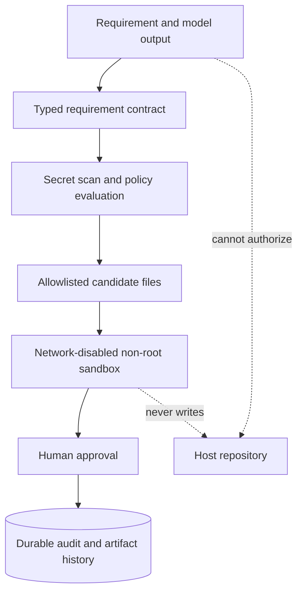
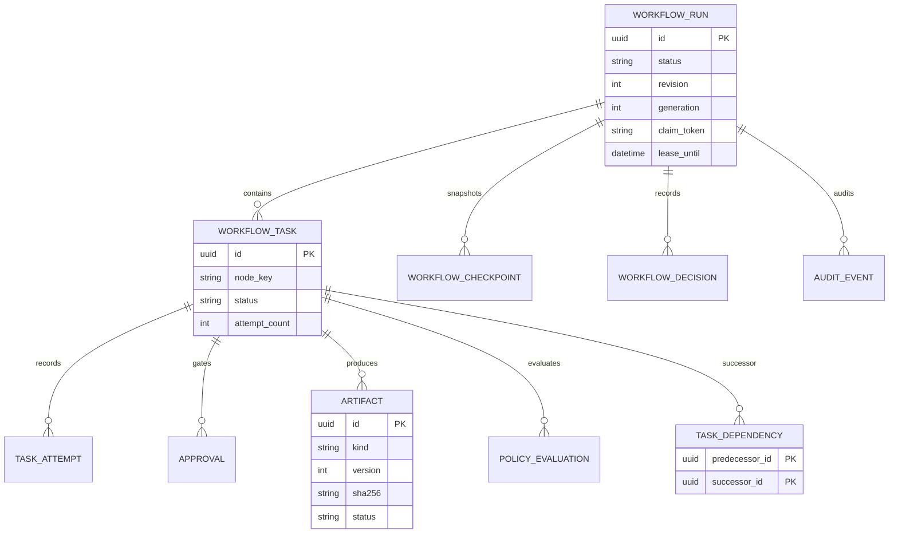
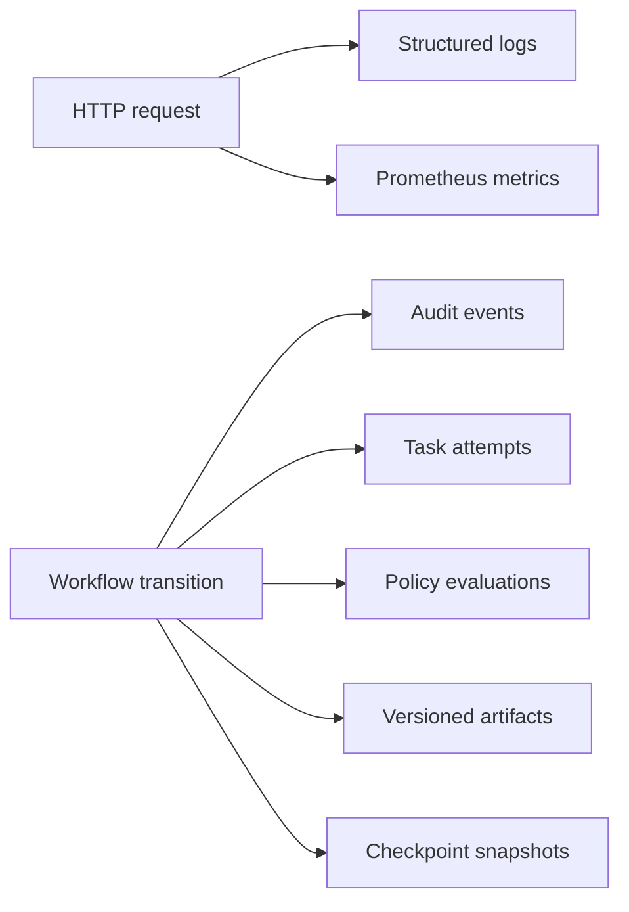

# Orbit : Final Engineering Summary

## Executive summary

Orbit is a local, governed software-engineering platform built around a working URL-shortening service. It combines product functionality with an agentic SDLC control plane that converts a natural-language requirement into a reviewable, validated engineering bundle.

The design keeps model output subordinate to deterministic application code. Models propose structured artifacts. The database owns workflow state, dependency edges, approvals, revisions, leases, and audit history. Typed contracts and allowlisted tools decide whether generated output can move to the next stage. Human reviewers approve the design and final release checkpoints.

The project demonstrates:

- a URL shortener with aliases, redirects, expiration, analytics, and lifecycle controls;
- a persisted dependency graph for greenfield, brownfield, ambiguous, and custom workflows;
- sequential and parallel task execution with dependency synchronization;
- deterministic fallback when the local model is unavailable or produces invalid output;
- isolated validation of generated source and tests;
- reviewer approval, approval-hash verification, audit history, rollback, retry, cancellation,
  replanning, and safe-stop recovery; and
- structured observability through logs, metrics, attempts, policies, artifacts, and checkpoints.

## Architecture overview

### Product and control-plane boundaries

The product plane manages real short links. The control plane manages proposed engineering work.
Generated code remains an artifact until it has passed validation and human review; the workflow
never patches the host repository automatically.

The additive assessment layer also provides a deeper bounded brownfield report. It extracts Python
AST symbols/import edges, API route declarations, model/schema indicators, test/configuration
inventories, keyword-ranked impacted files, and explicit data-flow review areas. Generated bundles
can be evaluated independently for API surface, persistence, error handling, executable tests,
documentation, syntax, and secret-scan quality findings without modifying workflow state or host
files.



### Runtime components

| Component | Responsibility | Main design choice |
|---|---|---|
| Next.js and TypeScript | Link operations, workflow review, graph and artifact views | Single operator interface |
| FastAPI | Typed HTTP API, authentication, validation, error mapping | Async request boundaries and OpenAPI |
| Link service | Alias creation, redirects, expiration, analytics, lifecycle updates | Domain service around a transactional session |
| Workflow engine | Dependency execution, approvals, recovery, artifacts, policy gates | Database-backed state machine |
| PostgreSQL | Durable product and workflow state | Transactional source of truth |
| Redis | Redirect lookup cache and rate-limit counters | Performance layer with graceful fallback |
| Ollama | Local model provider | No paid provider dependency |
| Deterministic provider | Reproducible contract-safe generation | Safety and availability fallback |
| Docker sandbox | Generated-code validation | No network, non-root, read-only container |
| Worker | Claims pending runs and renews execution leases | Restart recovery and fencing |

### Repository structure

```text
backend/app/
├── api/                 HTTP routes and response shaping
├── core/                configuration, auth, cache, errors, logging, metrics
├── db/                  SQLAlchemy base and domain models
├── orchestration/       graph engine, providers, contracts, sandbox, tools
└── services/            URL-shortener application service
backend/alembic/         database migrations
backend/tests/           API, workflow, governance, recovery, and sandbox tests
frontend/app/            Next.js screens and workflow review UI
compose.yaml             PostgreSQL, Redis, Ollama, API, worker, and web topology
```

The code uses a layered structure with dependency injection at the API boundary. The orchestration
provider interface applies the Strategy pattern. The Ollama provider and Docker sandbox are
Adapters around external systems. `RunStatus` and `TaskStatus` represent explicit state machines.
Checkpoints and rollback provide a Saga-like recovery model. Pydantic contracts form the validation
boundary between untrusted model output and trusted application state.

## URL-shortening product

### Request flow



### Product capabilities

- Generates random aliases or accepts custom aliases.
- Enforces case-insensitive uniqueness using application checks and a database unique index.
- Allows 301, 302, and 307 redirects.
- Rejects credentials, local hosts, private IPs, and non-global IP destinations.
- Supports timezone-aware future expiration and returns HTTP 410 after expiration.
- Tracks total clicks and daily click counts.
- Supports active, disabled, and deleted states.
- Uses optimistic version checks for concurrent updates.
- Supports idempotent creation through `Idempotency-Key`.
- Invalidates redirect cache entries after create, update, and delete operations.
- Stores reduced analytics data: hashed visitor identifiers and user-agent classes.

### Product safety controls

| Risk | Control |
|---|---|
| Alias collision | Case-insensitive database uniqueness plus conflict handling |
| Duplicate create request | Idempotency key and request payload hash |
| Unsafe destination | URL, credential, hostname, and IP validation |
| Expired destination | UTC-normalized future expiry and 410 response |
| Concurrent update | Version predicate and 409 conflict response |
| Cache inconsistency | Cache stores only link identity; current status is read from the database |
| Analytics privacy | Hashed visitor and user-agent values; no raw request payload logging |
| Redis outage | Redirect lookup and request processing fall back to PostgreSQL/application behavior |

## Agentic SDLC workflow

### Lifecycle graph

The graph is stored in `workflow_tasks` and `task_dependencies`. A task is runnable only when all
predecessors are complete. Independent tasks in the same wave execute concurrently, and descendants
wait for the complete wave.



### Stage responsibilities

| Stage | Output | Gate |
|---|---|---|
| Intake | Intent, actors, constraints, assumptions | Structured artifact contract |
| Normalize | Problem, capabilities, ambiguity, acceptance criteria | Supported and complete capability set |
| Decompose | Ordered work items and acceptance links | Exact coverage of accepted capabilities |
| Codebase analysis | Bounded read-only repository scan | Brownfield context only; no host mutation |
| Architecture | Components, interfaces, data model, trade-offs | Reviewer approval |
| Risk | Risks and controls | Reviewer approval with architecture |
| `work_*` | Capability-specific implementation candidate | Implementation contract and source validation |
| Implementation | Complete candidate source and baseline/diff metadata | Candidate path, syntax, and secret checks |
| Tests | Generated tests and sandbox results | Isolated execution evidence |
| Security | Candidate controls and source checks | Allowlisted checks must pass |
| Documentation | Setup, operations, limitations, decisions | Required document inventory |
| Release | Evidence-based readiness result | Tests, security, candidate hash, and docs agree |
| Final approval | Reviewer decision over release evidence | Reviewer approval required for handoff |

Dynamic work nodes such as `work_aliases` are normalized to the implementation contract at the
provider boundary. Invalid model output is rejected early and can use deterministic fallback instead
of failing later as an unexplained safe stop.

### Execution state machine



### Work execution and provider fallback



The provider contract distinguishes transient provider failures from non-retryable policy or schema
violations. Each attempt records provider, status, duration, revision, output, and error code. The
engine limits retries per invocation and across the revision. A safe stop preserves failed-task
state so a requester can retry, revise the requirement, or roll back to a checkpoint.

## Governance and security

### Trust boundaries



Implemented controls include:

- Pydantic schemas for requirements, work plans, generated files, approvals, revisions, and links.
- Secret scanning on requirements, comments, generated source, and generated tests.
- Candidate file allowlist limited to `main.py`, `test_generated.py`, and `README.md`.
- Path traversal and absolute-path rejection.
- Syntax validation before sandbox execution.
- No-network Docker execution as a non-root user with dropped capabilities and read-only root FS.
- Resource limits for memory, CPU, processes, file size, and execution time.
- Human approval at clarification, design, and final release gates.
- Approval payload hashes bound to the exact artifact and graph state.
- Requester/reviewer role separation; requesters cannot approve their own workflow.
- Stale artifact marking after revision or rollback.
- No automatic host repository mutation or deployment.

The default local bearer tokens are suitable only for the demonstration environment. A deployed
system should require externally supplied secrets at startup and use enterprise identity, TLS,
secret management, and centralized authorization.

## Persistence and recovery design

The database stores current workflow state plus graph topology, task attempts, generated artifacts,
policy results, approvals, decisions, audit events, and checkpoint snapshots. This makes it possible
to reconstruct why a workflow reached its current state.



Worker execution uses a claim token, generation number, and lease timestamp. Heartbeats renew the
lease. If a worker disappears, recovery marks the run safely stopped, marks interrupted tasks
failed, records an audit event, and removes labeled sandbox containers. Fencing prevents a stale
worker from committing late results after cancellation or replacement.

| Recovery action | Use |
|---|---|
| Retry | Re-run failed tasks while the revision retry budget remains |
| Replan | Change requirements or restart from an affected stage |
| Rollback | Restore checkpoint graph, context, task state, and artifact lineage |
| Cancel | Fence active execution and cancel pending/running tasks |
| Safe stop | Preserve evidence when progress is unsafe or inconsistent |

## Observability



Recorded evidence includes:

- correlation IDs across HTTP requests, service logs, and audit events;
- HTTP request counters and latency histograms;
- workflow terminal counts and duration by scenario;
- task attempts by node, provider, and status;
- recovery actions and recovery duration;
- actor, action, resource, outcome, and sanitized audit detail;
- artifact hashes, provider metadata, revision, baseline hash, and active/stale status;
- policy results for artifact schema, security, data minimization, and change control; and
- database-derived success rate, retry count, rollback count, MTTR, and average latency.

## Testing and validation

The repository contains 30 test functions across product, workflow, governance, recovery, and
sandbox suites.

Assessment-specific tests additionally cover brownfield dependency/API discovery, deterministic
candidate quality acceptance, invalid artifact rejection, and the workflow assessment endpoint.

| Area | Coverage |
|---|---|
| Link service | Creation, listing, redirects, duplicate aliases, disable/enable, deletion |
| Idempotency | Repeated request reuse and payload conflict |
| Analytics | Total and daily click counts, redirect types, concurrent clicks |
| Validation | Unsafe destinations, expiration, credentials, and alias rules |
| Concurrency | Optimistic update conflict and exclusive workflow claims |
| Workflow | Approval pauses, ambiguous clarification, brownfield analysis, parallel branches |
| Governance | Provider fallback, stage contracts, safe stop, secret/path checks |
| Recovery | Cancellation fencing, revision, stale artifacts, rollback, approval hashes |
| Sandbox | Generated source acceptance, failing tests, broken implementation, timeout cleanup |

Recommended validation commands:

```bash
.venv/bin/ruff check backend
.venv/bin/pytest -q
cd frontend && npm run build
npm audit --omit=dev
docker compose config --quiet
```

The real Docker sandbox tests are opt-in because they require the built sandbox image and a Docker
daemon:

```bash
RUN_DOCKER_TESTS=1 .venv/bin/pytest -q backend/tests/test_sandbox.py
```

## Engineering principles and patterns

### Principles followed

- Single responsibility at the module level: API, service, orchestration, provider, sandbox, and
  persistence concerns have identifiable homes.
- Explicit boundaries: model output, candidate files, database state, and approval transitions are
  validated before entering trusted execution.
- Dependency inversion: orchestration depends on the `AIProvider` interface rather than Ollama.
- Fail-safe behavior: incomplete graphs and failed policy checks stop execution rather than silently
  advancing.
- Reproducibility: deterministic generation, hashes, revisions, checkpoints, and persisted edges
  make results reviewable.
- Least privilege: candidate execution is isolated and network-disabled; the host workspace is
  mounted read-only in Compose.
- Observability: state transitions produce metrics, audit events, attempts, and artifacts.

### Patterns used

| Pattern | Implementation |
|---|---|
| Strategy | `AIProvider` implementations |
| Adapter | Ollama, Redis, Docker, and FastAPI integrations |
| State machine | Run and task status transitions |
| Saga/checkpoint recovery | Revision, rollback, fencing, and safe stop |
| Service layer | `LinkService` around domain operations and persistence |
| Dependency injection | FastAPI session and principal dependencies |
| Contract-first boundary | Pydantic stage and domain schemas |
| Observer/AOP | `observed()` service timing and failure logging |
| Bulkhead | Sandboxed generated-code execution with bounded resources |

## Trade-offs and known limitations

- Workflows run through the API/worker pair rather than a durable external queue.
- Cancellation cannot interrupt an in-flight provider request; it fences late results between stages.
- Brownfield analysis is bounded structural scanning, not a compiler-level call graph.
- The local model is small, so contracts, fallback, and human review carry much of the reliability
  burden.
- Redis rate limiting fails open during cache outage to preserve redirect availability; production
  deployments may prefer a configurable fail-closed mode.
- The workflow engine centralizes several lifecycle responsibilities. A larger deployment should
  split execution, approvals, artifacts, policy evaluation, and recovery into focused components.
- Default tokens must be replaced before any shared or deployed use.
- TLS, SSO, secret rotation, managed backups, external egress controls, and deployment approvals
  are integration responsibilities outside this local demonstration.

## Delivery checklist

The project is ready for a local engineering demonstration when:

- PostgreSQL and Redis are healthy;
- the API migration completes successfully;
- the worker can claim a pending workflow;
- the web application can reach the API;
- greenfield, brownfield, and ambiguous workflows reach their expected approval gates;
- generated candidates pass source and sandbox checks;
- review decisions appear in audit history; and
- retry, rollback, cancellation, and revision behavior is visible in the workflow timeline.

For any shared environment, replace local tokens, enable TLS, configure durable backups, restrict
Docker access, and review the generated artifact bundle before accepting release readiness.

## Detailed engineering design

### Boundary model

Orbit treats requirements, model responses, generated files, workflow state, and reviewer decisions
as different trust domains. Requirements and model output are untrusted input. Pydantic contracts
validate their shape; policy tools inspect secrets and file paths; the sandbox validates executable
behavior; the database persists only accepted stage results; and approval hashes bind human decisions
to the exact graph, revision, and artifact set that was reviewed.

This separation prevents a model from authorizing its own side effects. The provider proposes an
artifact, deterministic application code decides whether it satisfies the stage contract, and the
workflow state machine decides whether the next node is runnable.

### Request-to-outcome sequence

1. The API authenticates the requester and rejects secret-bearing requirements.
2. The engine creates a run, task nodes, dependency edges, initial decision, audit event, and
   checkpoint in one persistence boundary.
3. The worker claims the pending run with a claim token, generation, and lease.
4. Runnable non-approval nodes execute in a parallel wave. Each attempt records provider, revision,
   duration, status, output, and error code.
5. The provider output is validated against the stage contract. Invalid or unavailable model output
   can fall back to the deterministic provider.
6. Implementation artifacts pass path, syntax, secret, source-size, and sandbox checks before they
   become eligible evidence.
7. Approval nodes create a payload hash over the current graph and artifacts. A reviewer decision
   is accepted only when its hash still matches the state being approved.
8. Completion, rejection, retry, revision, rollback, cancellation, and safe-stop transitions are
   persisted with audit and checkpoint evidence.

### Brownfield reasoning

The original analyzer provides bounded keyword and file-impact scanning. The additive assessment
analyzer extends this with Python AST inspection and lightweight JavaScript/TypeScript route/import
extraction. It reports:

- module nodes and import edges;
- functions, classes, API route declarations, schema indicators, model indicators, and tests;
- configuration and dependency inventories;
- keyword-ranked impacted files with matched terms and symbols; and
- known product/workflow data flows that require architectural review.

The analyzer is intentionally read-only and bounded by the configured workspace and file limit. It
is an evidence aid, not a replacement for execution, type checking, or a compiler-grade call graph.

### Generated artifact quality

The additive quality gate evaluates generated implementation, test, and documentation artifacts
independently of the workflow engine. It verifies candidate allowlisting and syntax through the
existing engineering toolbox, then adds explicit findings for API framework presence, create/redirect
behavior, persistence signals, error handling, executable tests, assertions, documentation, setup
instructions, and secret scans.

Findings are severity-coded. Errors make the assessment report fail; warnings reduce its score but
remain reviewable. The workflow assessment endpoint combines this score with scenario metadata,
stage completion, approval gates, and current run state to produce a read-only release evidence
summary.

### Persistence and lineage

The relational model is the system of record. `workflow_runs` stores lifecycle and lease state;
`workflow_tasks` and `task_dependencies` store the executable DAG; `task_attempts` preserve retry
history; `artifacts` hold versioned outputs and hashes; `approvals`, `decisions`, and
`policy_evaluations` preserve control decisions; `workflow_checkpoints` preserve recoverable state;
and `audit_events` provide actor/resource/outcome traceability.

The design deliberately keeps current state and historical evidence together. A reviewer can inspect
not only what the latest artifact says, but also which provider produced it, which policies passed,
which revision it belongs to, which approval hash authorized it, and what recovery actions preceded
the current state.

### Failure and recovery semantics

The worker lease prevents abandoned execution from remaining indefinitely in `running`. Generation
and claim-token fencing prevent a stale worker from committing late results after cancellation or
replacement. Retry is bounded by both per-task and revision-level budgets. Non-retryable contract,
policy, or graph failures safe-stop the run while preserving evidence.

Requirement revision marks affected artifacts stale and rebuilds from the selected stage. Rollback
restores graph topology, normalized context, task state, and artifact lineage from a checkpoint;
final approval is intentionally reopened after rollback. Cancellation increments the generation,
fences active work, expires approvals, and cancels unfinished tasks.

### Security posture

The local prototype applies defense in depth: bearer-role separation, destination URL validation,
idempotency keys, optimistic link updates, hashed analytics identifiers, secret scanning, candidate
path allowlists, syntax checks, no-network sandbox execution, non-root containers, read-only root
filesystems, resource bounds, timeout cleanup, approval-hash fencing, and no host repository writes.

The remaining production controls are operational rather than hidden assumptions: enterprise
identity, TLS, secret rotation, centralized authorization, durable backups, external egress policy,
container runtime hardening, deployment approvals, and retained security telemetry.

### Verification strategy

Verification is layered:

- service tests exercise link, analytics, expiration, concurrency, and authorization behavior;
- workflow tests exercise scenario graph construction, approval pauses, parallel waves, fallback,
  retries, safe stop, revision, rollback, cancellation, and lease recovery;
- sandbox tests exercise valid candidates, invalid source, failed assertions, timeout cleanup, and
  path traversal isolation;
- assessment tests exercise brownfield dependency/API discovery, deterministic artifact acceptance,
  invalid artifact rejection, and workflow assessment reporting; and
- frontend and Compose checks validate the operator surface and local topology.

