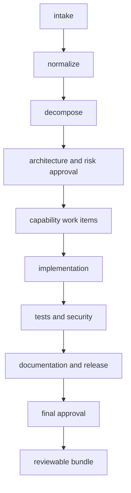

# Orbit : Agentic URL Engineer

Orbit is a URL-shortening application with a governed agentic software-engineering workflow.
It combines a working URL service with an orchestration system that turns requirements into
reviewable engineering artifacts.

## What the project does

### URL shortener

- Creates short URLs with generated or custom aliases.
- Supports optional titles, expiration dates, and 301/302/307 redirects.
- Redirects visitors to the original destination.
- Tracks click totals and daily analytics.
- Allows links to be copied, disabled, re-enabled, and deleted.
- Uses PostgreSQL for storage and Redis for caching and rate limiting.

### Agentic engineering workflows

- Accepts Greenfield, Brownfield, and Ambiguous requirements.
- Normalizes requirements and decomposes them into dependent tasks.
- Executes sequential and parallel workflow stages.
- Generates architecture, risk, implementation, test, security, documentation, and release artifacts.
- Requires reviewer approval at controlled checkpoints.
- Supports retries, deterministic fallback, cancellation, rollback, safe stop, and replanning.
- Records artifacts, decisions, attempts, policies, audit events, and reliability metrics.
- Uses local Ollama for AI generation and a deterministic provider when Ollama is unavailable.

Generated code is validated in an isolated temporary workspace. It is not automatically applied to
the project files.

Assessment evidence endpoints are available to authenticated operators:

- `POST /api/v1/assessment/brownfield` returns bounded AST/import/API/data-flow impact evidence.
- `POST /api/v1/assessment/artifact-quality` evaluates generated source, tests, documentation, and secret safety.
- `GET /api/v1/workflows/{id}/assessment` combines scenario, stage, brownfield, artifact-quality, and release evidence.

## Workflow lifecycle



Greenfield, brownfield, and ambiguous scenarios extend this graph with repository analysis or a
clarification checkpoint. Independent branches run concurrently when their dependencies are ready.
Failed work preserves attempts and evidence for retry, replanning, rollback, cancellation, or safe
stop recovery.

## Technology

- FastAPI and Python
- Next.js and TypeScript
- PostgreSQL
- Redis
- Ollama
- SQLAlchemy and Alembic
- Docker Compose

## Run the application

Requirements: Docker and Docker Compose.

```bash
docker compose up --build
```

The first run downloads the local Ollama model and may take several minutes. The `ollama-pull`
container exits with code 0 after the download; this is expected.

Open:

- Dashboard: http://localhost:3000
- API documentation: http://localhost:8000/docs
- Health endpoint: http://localhost:8000/health/ready
- Prometheus metrics: http://localhost:8000/metrics

Stop the application with:

```bash
docker compose down
```

## Use the application

The application uses two local roles to demonstrate separation of duties.

| Role | Token | Actions |
|---|---|---|
| Requester | `local-requester-token` | Create/manage links and create/revise workflows |
| Reviewer | `local-reviewer-token` | Approve/reject workflow checkpoints and perform rollback |

### Shorten a URL

1. Open the dashboard and select **Links**.
2. Select **Set access token** and enter `local-requester-token`.
3. Select **Create link**.
4. Enter the destination URL and any optional settings.
5. Select **Create link** in the form.

The short URL appears in the Links table. Use its actions to copy it, open it, view analytics,
enable/disable it, or delete it.

### Run an engineering workflow

1. Select **Workflows** while signed in as the requester.
2. Select **New workflow**.
3. Choose Greenfield, Brownfield, or Ambiguous and submit the requirement.
4. Open the workflow to inspect its dependency graph and generated artifacts.
5. When it reaches `waiting approval`, select the access button and enter
   `local-reviewer-token`.
6. Review the evidence and approve or reject the checkpoint.

Ambiguous workflows require a clarification note before approval. A requester cannot approve their
own workflow.

Generated work items such as `work_aliases` are validated using the implementation contract before
they can advance. Invalid model output can fall back to the deterministic provider instead of
being accepted into the dependency graph.

## Local development

### Backend

```bash
python3 -m venv .venv
.venv/bin/pip install -e '.[dev]'
DATABASE_URL=sqlite+aiosqlite:///./agentic.db .venv/bin/alembic upgrade head
PYTHONPATH=backend .venv/bin/uvicorn app.main:app --reload
```

### Frontend

In a second terminal:

```bash
cd frontend
npm install
npm run dev
```

### Worker and sandbox

The Compose worker claims pending workflows, renews execution leases, and recovers expired claims.
Generated candidates are checked in a disposable Docker container with no network access, a
non-root user, dropped capabilities, read-only filesystem, bounded CPU/memory, and a temporary
workspace.

## Validate changes

```bash
.venv/bin/ruff check backend
.venv/bin/pytest -q
cd frontend
npm run build
npm audit --omit=dev
```

Validate the Docker configuration with:

```bash
docker compose config --quiet
```

The real Docker sandbox tests require the built sandbox image and are opt-in:

```bash
RUN_DOCKER_TESTS=1 .venv/bin/pytest -q backend/tests/test_sandbox.py
```

## Project structure

```text
backend/app/                 FastAPI application and domain services
backend/app/orchestration/   Workflow graph, providers, policies, and validation
backend/alembic/             Database migrations
backend/tests/               Backend and API tests
frontend/app/                Next.js dashboard
FINAL_ENGINEERING_SUMMARY.md Detailed architecture, controls, recovery, patterns, and validation
compose.yaml                 Local application topology
```

## Documentation

- [Final engineering summary](FINAL_ENGINEERING_SUMMARY.md)

## Product and engineering model

Orbit has two deliberately separated surfaces:

1. The product surface manages real short links. Requesters create aliases, redirect visitors,
   inspect click analytics, and control link lifecycle state.
2. The engineering surface turns a natural-language requirement into a governed change proposal.
   It produces structured artifacts, records decisions and evidence, validates generated code in an
   isolated environment, and pauses for reviewer approval before design and release transitions.

The engineering surface is intentionally proposal-oriented. Generated files are reviewable
artifacts in a database-backed workflow; they are never silently copied into the host repository,
deployed, or treated as trusted merely because a model produced them.

## End-to-end workflow behavior

Every workflow is represented as a persisted directed acyclic graph. A worker claims the run with a
lease and fencing token, finds runnable tasks whose dependencies are complete, and executes one
parallel wave at a time. The graph synchronizes independent branches before advancing to dependent
work.

The standard path is:

`intake → normalize → decompose → architecture + risk → design approval → implementation → tests + security → documentation → release → final approval`

Greenfield requests use the standard path. Brownfield requests add bounded repository analysis
before decomposition. Ambiguous requests add a clarification checkpoint before work planning.
Failures preserve attempts and evidence; reviewers or requesters can reject, retry, revise,
rollback, cancel, or safely stop a run according to role and state.

## API surface

The primary product endpoints are under `/api/v1/links`; the redirect endpoint is `/{alias}`.
Workflow management is under `/api/v1/workflows`, with separate endpoints for graph topology,
approvals, artifacts, attempts, checkpoints, decisions, policies, audit history, metrics, and
review-bundle download.

Assessment evidence endpoints are also available:

| Endpoint | Purpose |
|---|---|
| `POST /api/v1/assessment/brownfield` | Produce bounded AST, import, route, model, schema, test, configuration, and impact evidence. |
| `POST /api/v1/assessment/artifact-quality` | Check candidate API surface, persistence signals, error handling, tests, documentation, syntax, and secret safety. |
| `GET /api/v1/workflows/{id}/assessment` | Combine scenario, stage, artifact-quality, brownfield, and release evidence into one read-only report. |

All management endpoints require a bearer token. Requester permissions cover product changes and
workflow creation/revision; reviewer permissions cover approval and rollback. The default tokens
are demonstration credentials and must be replaced before shared use.

## Scenario runbook

To demonstrate the assessment:

1. Start the stack and sign in as the requester.
2. Create a greenfield workflow such as “Build a URL shortener with aliases and daily analytics.”
3. Inspect normalized intent, the dependency graph, architecture/risk artifacts, and the design gate.
4. Sign in as the reviewer and approve the design checkpoint.
5. Inspect implementation, generated tests, sandbox evidence, security checks, documentation, and
   release readiness.
6. Approve the final checkpoint and download the review bundle.
7. Repeat with a brownfield requirement to see repository impact evidence, then with an ambiguous
   requirement to see the clarification gate.

The workflow detail screen is organized around current state: artifact review, approval actions,
dependency topology, recovery checkpoints, and stage outputs. Operational events remain available
through the Activity view and API endpoints without crowding the primary review surface.

## Operational expectations

For a local demonstration, Docker Compose provides PostgreSQL, Redis, the API, worker, local
Ollama, sandbox image, and Next.js UI. For a production deployment, add enterprise identity,
TLS, managed secret storage, backups, queue durability, Docker isolation controls, deployment
approvals, and centralized log/metric retention. Those controls are deliberately documented as
deployment responsibilities rather than simulated by the local prototype.
